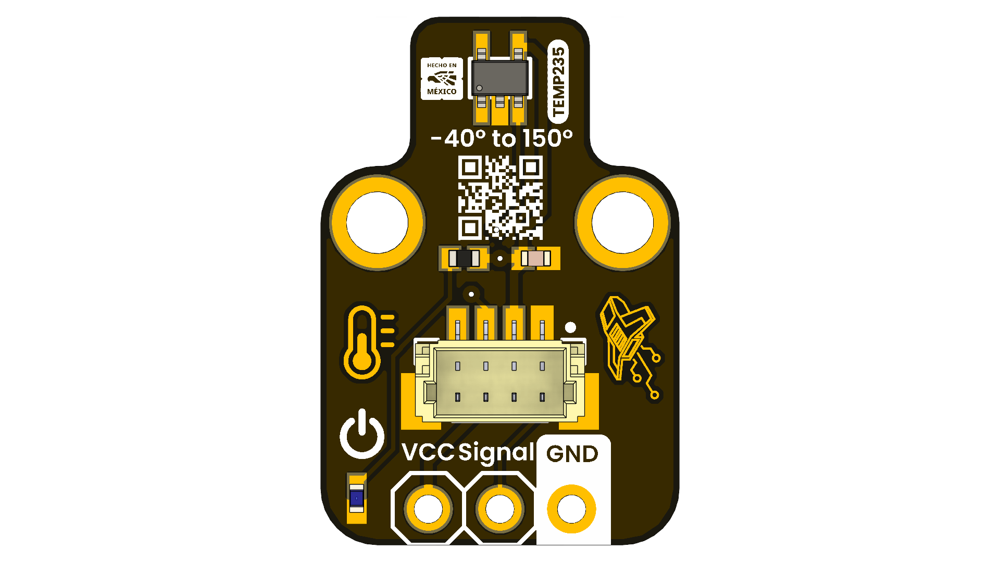

# TEMP235 - I2C Temperature Sensor Module

  
  
  
  
   

## Introduction

The TEMP235 is a high-precision I2C temperature sensor module designed for accurate temperature measurements in various applications. It features a digital output, low power consumption, and a wide operating voltage range, making it ideal for embedded systems, environmental monitoring, and IoT projects.

  
  
<em>Temp235</em>

### Quick Setup

##  Overview

| Feature        | Description                                                                 |
|----------------|-----------------------------------------------------------------------------|
| Sensor Type    | Digital Temperature Sensor (I2C Interface)                                  |
| Temperature Range | -40°C to +125°C                                                          |
| Accuracy       | ±0.5°C                                                                     |
| Resolution     | 0.1°C                                                                      |
| Operating Voltage | 2.7V to 5.5V                                                            |
| Communication  | I2C (up to 400kHz)                                                        |
| Power Consumption | 10µA (typical)                                                          |

## Use Cases

- Data logging: Store sensor data, logs, or event histories
- Configuration retention: Preserve device settings or calibration data
- Embedded memory: Add persistent storage to microcontroller projects

##  Resources

- [Schematic Diagram](hardware/resources/unit_top_v_1_0_ue0101_TEMP235_schematic.pdf)
- [Pinout Diagram](hardware/resources/unit_top_v_1_0_ue0101_TEMP235_pinout.pdf)
- [Firmware Examples](software/examples)
- [Getting Started Guide](docs/getting_started.md)

## License

This product and its documentation are licensed under the MIT License.  
See [`LICENSE.md`](LICENSE.md) for details.

  Template by UNIT Electronics

